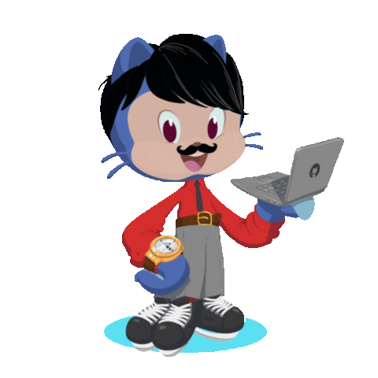

<h3>Technical way to communicate by</h3>

###

  

    

<h2></h2> 

 
   

###
<h2></h2> 
<h3 align="left">🔥   My Stats :</h3>

<h2></h2> 

 
   

  
  

  ###

  

If 💙 , Good to express as ⭐ and Share it with fellow Developer!
<h1 align='center'>⚡️<i>Just Rock!</i>⚡️</h1>

<h1 align=left >Code Cycle</h1> 

&nbsp;&nbsp;&nbsp;&nbsp;&nbsp;

&nbsp;&nbsp;&nbsp;&nbsp;&nbsp;
 

